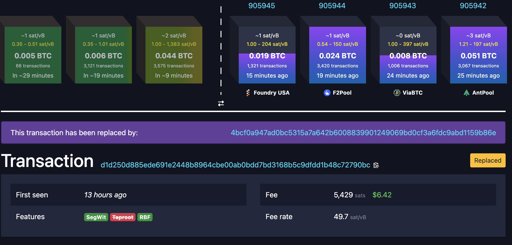

# Bitcoin Core Mempool Data Pipeline

This project sets up a data pipeline to collect, process, and enrich mempool data from Bitcoin Core, and organizing it at a block level for deeper analysis.

## Project Structure

The pipeline is split into two main parts:

### 1. **Watching the Mempool and Writing Avro Files**

A script called `mempool_to_avrofiles_watcher.py` watches the `debug.log` file of a Bitcoin Core node. It looks for `AcceptToMemoryPool` events and turns those into structured records. These records are saved as **Avro files** and uploaded to a **Google Cloud Storage (GCS)**.

Each file includes the name of the machine and the time it was created. Files are stored in folders that follow this structure:

```
    gcs_path = f"source={SOURCE}/dt={date}/{filename}"
    filename = f"{HOSTNAME}.{timestamp}.avro"
    
    with source = 'bmon' if using the bmon project for retrieving the logs.
      or source = 'bitcoinJungle' if using this project for retrieving the logs.
```

In this project, the script runs as a service on a VM, but it can also be deployed on other machines running Bitcoin Core.


### 2. **Ingesting and Processing Data in BigQuery**

Once the Avro files are uploaded to **Google Cloud Storage**, they are exposed to **BigQuery** via an external table. The table is partitioned automatically based on the folder path structure used in GCS.

From there, a series of scheduled queries transform and enrich the data.


#### **Step 1: Deduplication - `deduplicate_bloclevel_tx.sql.tpl`**

Because this watcher script is designed to run on multiple nodes worldwide, the same transaction may be logged multiple times, each with a different timestamp. This query keeps only one record per transaction and adds two useful fields:

- `first_seen_timestamp`: the earliest time any node observed the transaction.
- `last_seen_timestamp`: the most recent time it was observed.

This helps understand how transactions propagate through the network and might be valuable for latency analysis and mempool monitoring.

#### **Step 2: Tagging Replaced Transactions - `flag_replaced_transactions.sql.tpl`**

This query looks for transactions that have been replaced and updates the original (replaced) transaction with the hash of the new one, in the `replaced_by` field.

For example : 




#### **Steps 3–5: Block-Level Aggregation**

These queries attempt to match mempool transactions to blockchain data:

- `standard_bloclevel_update.sql.tpl`
- `extended_bloclevel_update.sql.tpl`
- `longtail_bloclevel_update.sql.tpl`

The logic is nearly the same across them, but the **time window** for matching varies to optimize for cost :

- **Standard**: checks if the transaction was mined within 1 hour after it was last seen.
- **Extended**: expands the window to 24 hours.
- **Longtail**: stretches it further to 7 days.

Each query only processes unmatched transactions left over from the previous one. You can optionally run a full-range match periodically (e.g., monthly or yearly) to catch late-mined transactions that slipped through.


An example of the data : 

| Ligne | txid                                                         | first_seen_timestamp           | last_seen_timestamp            | block_timestamp         | block_height | size | virtual_size | output_value | fee  | replaced_by                                                  | deduplicated_at                | aggregated_at                  | aggregated_by              | modified_at                    | created_at                     |
| ----- | ------------------------------------------------------------ | ------------------------------ | ------------------------------ | ----------------------- | ------------ | ---- | ------------ | ------------ | ---- | ------------------------------------------------------------ | ------------------------------ | ------------------------------ | -------------------------- | ------------------------------ | ------------------------------ |
| 1     | fffef6d797e650a49a3b6eb7682b8e74c0a1b647efd28d9e6591af9887763d91 | 2025-07-16 19:57:18.755779 UTC | 2025-07-16 19:57:18.755779 UTC | 2025-07-16 20:05:22 UTC | 905865       | 383  | 301          | 97909695     | 2167 | null                                                         | 2025-07-17 02:00:18.391195 UTC | 2025-07-17 09:42:11.099894 UTC | standard_blocklevel_update | 2025-07-17 09:42:11.099894 UTC | 2025-07-17 02:00:18.391195 UTC |
| 2     | d1d250d885ede691e2448b8964cbe00ab0bdd7bd3168b5c9dfdd1b48c72790bc | 2025-07-16 22:47:41.108430 UTC | 2025-07-16 22:47:41.108430 UTC | null                    | null         | null | null         | null         | null | 4bcf0a947ad0bc5315a7a642b6008839901249069bd0cf3a6fdc9abd1159b86e | 2025-07-17 02:00:18.391195 UTC | null                           | null                       | 2025-07-17 05:00:17.411102 UTC | 2025-07-17 02:00:18.391195 UTC |


### 3. **Option 1: Direct Ingestion via Pub/Sub (Deprecated)**

You’ll notice in the code that there's a commented-out **Option 1**, which represents an alternate way of collecting data from the `debug.log`.

In this setup, transactions are captured and immediately published to a **Pub/Sub** topic, which streams the data directly into a **BigQuery** table.

While this approach works, it comes with two major drawbacks:

- It **doesn't handle replacement transactions** yet. While support for this feature could be added in the future, it’s currently not implemented in Option 1. Which means replaced and replacing transactions are not linked.
- It's **not cost-effective** : all transaction events are stored directly in BigQuery, which can quickly become expensive.

For these reasons, this method is considered deprecated. The recommended approach is to write the data as **Avro files to GCS**, which is more flexible, efficient, and cost-controlled.


------


## Compatibility with the bmon Project

This project was built with the [bmon project](https://github.com/chaincodelabs/bmon/tree/master) in mind. bmon already does a great job tracking mempool activity, so this project aligned the structure of the Avro files, table partitions, and data formats to be compatible with the bmon project.

That means both projects can run side-by-side, and data from each can be combined easily. If you haven’t seen bmon yet, it’s worth checking out, especially if you’re interested in mempool log analysis.


------


## 🔧 Setup & Deployment

### I - Run the Full Pipeline with Terraform

#### Prerequisites

- A Google Cloud project
- `terraform` installed
- `gcloud` CLI authenticated
- A `terraform.tfvars` file with the following values:

```terraform
project_id                  = "your-gcp-project"
region                      = "your-gcp-region"
zone                        = "your-gcp-zone"
bucket_name                 = "your-gcs-bucket"
bucket_location             = "location"
avro_file_dir               = "../samples/avrofiles"
bq_dataset_id               = "your_dataset_id"
bq_location                 = "location"
vm_image                    = "projects/debian-cloud/global/images/debian-12-bookworm-v20250610"
subnetwork_id               = "projects/your-project/regions/your-region/subnetworks/default"
service_account_email       = "your-vm-service-account@your-project.iam.gserviceaccount.com"
scripts_bucket_name         = "your-terraform-script-bucket"
hostname                    = "b-01.slug"
# Optionally, for the deprecated Option 1:
# pubsub_topic_name         = "mempool-topic"
```

#### ⚠️ VM Sizing Note

The default machine type is `n2d-standard-8`, which syncs the Bitcoin blockchain (IBD) in roughly 10 hours. You can select a cheaper VM type in the main.tf, this will cause the initial sync to take longer.

#### 🚀 Deploy

```sh
terraform init
terraform plan
terraform apply
```


### II - Running the `mempool_to_avrofiles_watcher.py` Script Only

You can run the script independently on any machine that has access to a running **Bitcoin Core node**.

While the ideal setup is to deploy the full project infrastructure (via Terraform), you can then run the script separately on additional nodes and configure it to send Avro files to the same **GCS bucket** used by your main deployment.

This allows you to collect mempool data from multiple geographically distributed nodes, enriching the dataset with different `AcceptToMemoryPool` timestamps for the same transactions.

#### Prerequisites

- Python 3+
- `pip` (Python package manager)
- Access to a running **Bitcoin Core node** with `debug.log` enabled
- A **Google Cloud Storage (GCS)** bucket
- A **Google Cloud service account** with permission to write to GCS (`roles/storage.objectCreator` or higher)

#### Install Python & Packages

If you're using a separate user for your Bitcoin node (e.g., `bitcoin`), you'll need to install and run the script as that user:

```sh
apt-get install -y python3 python3-pip python3-venv 

# Switch to the bitcoin user
sudo -u bitcoin python3 -m venv /home/bitcoin/project/venv
sudo -u bitcoin /home/bitcoin/project/venv/bin/python -m pip install --quiet --upgrade pip
sudo -u bitcoin /home/bitcoin/project/venv/bin/python -m pip install --quiet fastavro google-cloud-storage
```

#### Set Required Environment Variables

```sh
export BUCKET_NAME="your-gcs-bucket-name"
export HOSTNAME="your-node-id"  # e.g., b-01.slug
export SOURCE="your-source" # can be this project bitcoinJungle or another mempool monitoring project as bmon
export GOOGLE_APPLICATION_CREDENTIALS="/path/to/service-account-key.json"
```

#### Run the Watcher under the bitcoin user

```sh
sudo -u bitcoin /home/bitcoin/project/venv/bin/python mempool_to_avrofiles_watcher.py
```

The script will:

- Continuously read `debug.log`
- Parse `AcceptToMemoryPool` events
- Batch and write them as **Avro** files
- Upload to GCS using the structure:

```
gs://your-gcs-bucket/source=<SOURCE>/dt=YYYY-MM-DD/<HOSTNAME>.YYYY-MM-DDTHH-MM-SS.avro
```

------

## Bitcoin Node Logging Configuration

To ensure logs are in the right format, configure the logs in `bitcoin.conf` as follows:

```
server=1
prune=3000
dbcache=8192

#This part is necessary : 
debug=mempool
#debug=mempoolrej  # Not supported yet
logthreadnames=1
logtimemicros=1
```

🚫 **Do NOT enable `debug=mempoolrej` yet**
 Support for mempool rejection logs (`mempoolrej`) is planned but not currently implemented.

------

